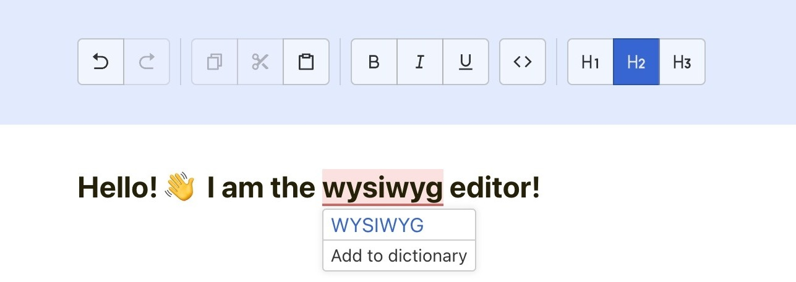

# Simple Wysiwyg Editor with spell-checking


## Available features
- Spellchecking in English
- Highlighting of errors
- Choosing suggestions by click


- Undo/Redo history
- Copy/Cut/Paste
- Bold, underline, italic decorations
- Headings
- Inline code blocks


### Run locally

In the project directory, you can run:

```
npm i
npm run start
```

Runs the app in the development mode.\
Open [http://localhost:3000](http://localhost:3000) to view it in the browser.

### Run tests

`npm test`

Launches the test runner in the interactive watch mode.

### Libraries used

- [Remirror](https://github.com/remirror/remirror) (based on Prosemirror)
- [nSpell](https://github.com/wooorm/nspell)

Project was bootstrapped with [Create React App](https://github.com/facebook/create-react-app).

### How dictionaries are stored

Dictionaries are stored in plain `.dic` and `.aff` files in `/public/dictionaries` folder. By default, English dictionaries are stored.

`.dic` file is a dictionary (in its usual sense), containing all known words. Each word may **optionally** be followed by a slash `/` and one or more flags, which represents affixes or special attributes ([usage](http://pwet.fr/man/linux/fichiers_speciaux/hunspell/#:~:text=Hunspell(1)%20requires%20two%20files,of%20words%2C%20one%20per%20line.)).

First line of the file must contain the total number of words in dictionary.

_Example:_
```text
4
lol
kek
cheburek
smesharik
```
`.aff` file contains a list of rules and other options for hunspell-like checkers, that may improve their quality. **May be omitted.**

Examples of dictionaries for other languages can be found [here](https://github.com/wooorm/dictionaries/).

### Demo / Where to find a built version

Production version is automatically built directly to [/gh-pages](https://github.com/amanokh/JB-Wysiwyg/tree/gh-pages) branch on each commit, using Github Workflows.

The current state is available at https://wysiwyg.manokh.com.